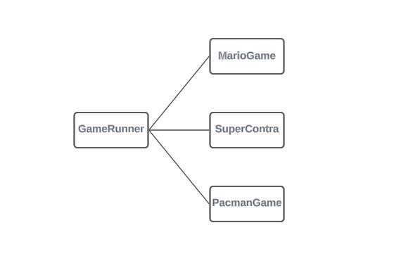
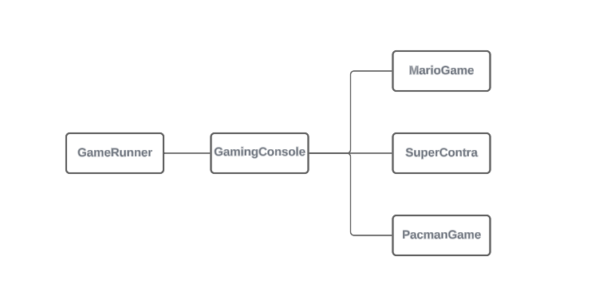
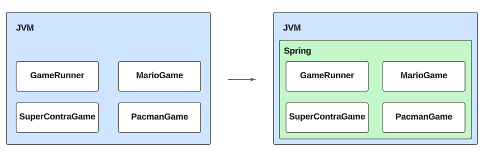

# Gaming Application - Learning Spring Framework

This is a learning project taken from the Udemy course [Master Spring Boot 3 & Spring Framework 6 with Java](https://www.udemy.com/course/spring-boot-and-spring-framework-tutorial-for-beginners/) which showcases the core concepts of the Spring Framework.

### Prerequisites

To use this project, you need to have knowledge of:

+ Java - Object Oriented Programming Language.
+ Spring Framework - Application framework and inversion of control container for the Java platform.

### Installing the Project

To download this project, run the following command down below.

```
git clone https://github.com/JuanPablo70/JavaGamingApplication.git
```

### About this Project

This project focuses on utilizing the Spring framework to develop a platform for running classic games such as Mario, SuperContra, and Pacman. The project evolves through several iterations to demonstrate the advantages of employing Inversion of Control (IoC) principles.

+ **Iteration 1 (commit 1): Tightly Coupled Java Code**

  In the initial iteration, the project exhibits tightly coupled Java code. The GameRunner class directly depends on the MarioGame class for game execution. This tightly bound structure resides within the AppGaming class, limiting flexibility and maintainability.

  

+ **Iteration 2 (commit 2): Loosely Coupled - Interface**

  To mitigate tight coupling, the GamingConsole interface is introduced. Game classes such as MarioGame, PacmanGame, and SuperContraGame now implement this interface, allowing the GameRunner class to execute any game. However, game instantiation still occurs within the AppGaming class.

  

+ **Iteration 3 (commit 3): Loosely Coupled - Spring Level 1**

  In this iteration, the project transitions to a loosely coupled architecture. A GamingConfiguration class is introduced with the @Configuration annotation to define beans via the @Bean annotation. Despite manual instantiation, the @Primary annotation assigns priority to the MarioGame. The application utilizes Annotation Context to load beans via the GamingConfiguration class.

  

+ **Iteration 4 (commit 4): Loosely Coupled - Spring Level 2**

  The AppGaming class transforms into the GamingConfiguration class, leveraging the @Configuration and @ComponentScan annotations. This iteration automates bean discovery using @Component annotations. Additionally, the GameRunner constructor utilizes @Qualifier annotations to select the SuperContra game for execution.

### Build With

+ [Spring Initializr](https://start.spring.io) - Tool used to set up Spring Boot projects.
+ [Maven](https://maven.apache.org) - Software project management and comprehension tool.

### Version

1.0

### Author

[Juan Pablo Sánchez Bermúdez](https://github.com/JuanPablo70)
